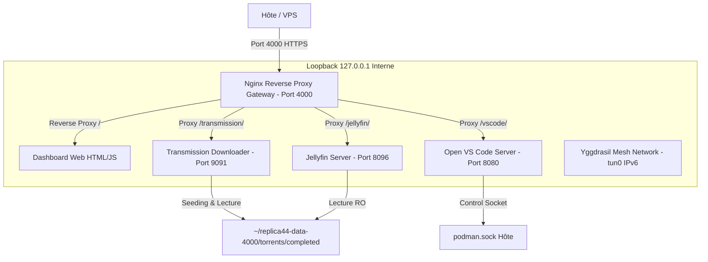

# Architecture Technique Détaillée - Replica 44

Ce document décrit l'architecture technique, la topologie réseau, la gestion des volumes et la sécurisation du projet **Replica 44**.

---

## 1. Topologie du Podman Pod unifié

Tous les conteneurs sont isolés au sein du même namespace réseau Podman (`replica44-pod-${REPLICA44_INSTANCE_ID}`) en mode rootless. Ils communiquent en interne via `127.0.0.1` (loopback unifiée).

---

## 2. Rôles et Spécifications des Conteneurs

| Conteneur | Image Docker/Podman | Droits & Spécificités | Volumes Montés |
| :--- | :--- | :--- | :--- |
| **Gateway** | `docker.io/library/nginx:alpine` | Reverse Proxy HTTPS sur port base (`4000`) | `/usr/share/nginx/html`, `/etc/nginx/certs`, `/etc/nginx/nginx.conf` |
| **Jellyfin** | `docker.io/jellyfin/jellyfin:latest` | Mode streaming média (Prénavigué) | `/config`, `/media` (Lecture seule `:ro`) |
| **Transmission** | `lscr.io/linuxserver/transmission:latest` | Seeding illimité et mode "As-a-File" | `/config`, `/watch`, `/completed` |
| **Open VS Code** | `docker.io/codercom/code-server:latest` | `CAP_NET_ADMIN`, Socket Podman monté | `/home/coder/project` (IDE), `/home/coder/replica44-infra` |
| **Yggdrasil** | `docker.io/cofob/yggdrasil:latest` | `CAP_NET_ADMIN`, Device `/dev/net/tun` | Interface réseau virtuel `tun0` pour routage mesh IPv6 |

---

## 3. Stratégie de Stockage et Volumes

### A. Volume de Données Utilisateur (`~/replica44-data-${INSTANCE_ID}/`)
- `config/gateway/` : Reçoit `nginx.conf`, `index.html`, `services.json` et le dossier `certs/` (`replica44.crt`, `replica44.key`).
- `config/jellyfin/` : Stocke la base de données et les métadonnées de diffusion Jellyfin.
- `config/transmission/` : Stocke le fichier `settings.json` et la file d'attente.
- `ide_workspace/` : Espace de travail de l'IDE VS Code Server.

### B. Stockage Média Lourd (`REPLICA44_MEDIA_DIR`)
Par défaut positionné sur `${HOME}/replica44-data-${INSTANCE_ID}/torrents`, modifiable via `.env` :
- `torrents/watch/` : Dossier surveillé pour l'ajout automatique de `.torrent`.
- `torrents/completed/.incomplete/` : Zone temporaire pour les téléchargements en cours.
- `torrents/completed/` : Zone finale pour le **seeding P2P continu** Transmission et la **lecture streaming** Jellyfin simultanée.

---

## 5. Synchronisation Inter-VPS Yggdrasil & Validation IPv6

1. **Validation & Nettoyage de l'IP Cible** :
   - Le script `configs/sync/sync_node.sh` et le validateur JavaScript côté navigateur nettoient automatiquement l'IP saisie (suppression des préfixes `tcp://`, des crochets `[...]` et des ports `:12345`).
   - Une expression régulière vérifie la conformité de l'adresse IPv6 Yggdrasil.

2. **Contrôle de Joignabilité (Ping/Timeout)** :
   - Avant de démarrer la synchronisation `rsync`, un test `ping -c 1 -W 3` vérifie que le nœud Yggdrasil distant est en ligne et joignable.
   - En cas de timeout ou de nœud hors-ligne, un code de retour explicite (code 2) est émis et retransmis au tableau de bord.

3. **Autonomie `rsync`** :
   - L'utilitaire `rsync` est garanti présent à la fois sur le système hôte (installé par `install_fedora.sh`) et dans le conteneur Open VS Code.

4. **Déverrouillage Sécurisé** :
   - L'accès à la synchronisation sur le Dashboard est protégé par un bouton de déverrouillage qui contrôle le mot de passe Gateway auprès de l'endpoint `/api/sync`.
